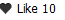

Yii-LikeButton
==============

Widget to render Like button on your page.

[]

Requirements
============
Yii 1.1.13 or hight
Bootstrap css (for heart icon)

Install
=======

1. Download latest version
2. Copy Yii-LikeButton/* to protected/extensions/LikeButton
3. Define component in config/main.php
>'import'=>array(
>		.....
>		'application.extensions.LikeButton.*',
>	),

Usage
=====

Insert in your view 

$this->widget('LikeButton', array(
		'count'=>10, 
		'id'=>1,
		'title'=>'Like',
		'incUrl'=>'http://...',
		'decUrl'=>'http://...',
		'alreadyVote'=>true
		));

*count* - current number of votes
*id* - uniq id
*title* - you translation of Like (Нравится, Votes)
*incUrl* - after click ajax get this url if need inc votes
*decUrl* - after click ajax get this url if need dec votes 
*alreadyVote* - if true then you can do only one minus, else plus

 	
	
	